# Psychic Tribble - Task Management & Calendar App


>  **MVP Development Phase** - A modern, secure, and scalable task management and calendar application built with FastAPI.

## Project Overview

Psychic Tribble is a comprehensive task management and calendar application designed for modern productivity needs. The project is currently in MVP development phase, focusing on building a robust backend API that will power web and mobile applications.

### Planned Features

- **Task Management**: Create, organize, and track tasks with priorities, due dates, and categories
- **Calendar Integration**: Seamless calendar view with task scheduling and event management
- **User Authentication**: Secure JWT-based authentication with password hashing
- **Cross-Platform**: Web application with planned Android and iOS mobile apps
- **Real-time Updates**: Live synchronization across devices
- **Team Collaboration**: Shared workspaces and task assignment (future)

### 🏗️ Architecture

The application follows a modern, modular architecture:

- **Backend**: FastAPI with async/await support
- **Database**: SQLAlchemy ORM with connection pooling
- **Authentication**: JWT tokens with bcrypt password hashing
- **API Design**: RESTful API with versioning (`/v1/` prefix)
- **Security**: Comprehensive middleware stack with rate limiting
- **Monitoring**: Request correlation tracking and health checks

## 🛠️ Technology Stack

### Core Framework
- **FastAPI**   : Modern, fast web framework for building APIs
- **SQLAlchemy**: Python SQL toolkit and ORM
- **Uvicorn**   : Lightning-fast ASGI server

### Security & Authentication
- **bcrypt**         : Secure password hashing
- **python-jose**    : JWT token creation and verification
- **CORS middleware**: Cross-origin request handling
- **Rate limiting**  : Built-in request throttling

### Development Tools
- **pytest**    : Test framework with async support and coverage
- **ruff**      : Fast linting and formatting (replaces black, flake8, isort)
- **pre-commit**: Git hooks for code quality
- **tox**       : Multi-environment testing
- **IPython**   : Interactive debugging shell

## 🚀 Getting Started

### Prerequisites

- Python 3.8 or higher
- pip or poetry for package management
- Git for version control

### Installation

1. **Clone the repository**
   ```bash
   git clone https://github.com/yourusername/psychic-tribble.git
   cd psychic-tribble
   ```

2. **Create a virtual environment**
   ```bash
   python -m venv venv
   source venv/bin/activate  # On Windows: venv\Scripts\activate
   ```

3. **Install dependencies**
   ```bash
   # Install production dependencies
   pip install -r requirements.txt
   
   # Install development dependencies (for contributors)
   pip install -r requirements-dev.txt
   ```

4. **Set up pre-commit hooks** (for development)
   ```bash
   pre-commit install
   ```

### Configuration

Create a `.env` file in the project root:

```env
# Application
ENV=development
DEBUG=True
API_HOST=0.0.0.0
API_PORT=8000

# Security
SECRET_KEY=your-super-secret-key-here
ACCESS_TOKEN_EXPIRE_MINUTES=30

# Database
DATABASE_URL=sqlite:///./psychic_tribble.db

# CORS
ALLOWED_CORS_ORIGINS=["http://localhost:3000", "http://localhost:8080"]

# Rate Limiting
DEFAULT_RATE_LIMIT=100/hour
ENABLE_HTTPS_REDIRECT=false
```

### Running the Application

1. **Start the development server**
   ```bash
   uvicorn psychic_tribble.main:app --reload --host 0.0.0.0 --port 8000
   ```

2. **Access the application**
   - API Documentation: http://localhost:8000/docs
   - Alternative Docs: http://localhost:8000/redoc
   - Health Check: http://localhost:8000/health

## 🧪 Testing

### Running Tests

```bash
# Run all tests
pytest

# Run tests with coverage
pytest --cov=psychic_tribble --cov-report=html

# Run tests in multiple environments
tox
```

### Test Structure

- **Unit Tests**: Test individual functions and classes
- **Integration Tests**: Test API endpoints and database interactions
- **Coverage**: Maintain >90% test coverage

## 📊 API Documentation

The API follows RESTful principles with comprehensive OpenAPI documentation.

### Core Endpoints

- `GET /` - Root health check
- `GET /health` - Detailed health status
- `GET /v1/tasks` - List tasks
- `POST /v1/tasks` - Create task
- `PUT /v1/tasks/{task_id}` - Update task
- `DELETE /v1/tasks/{task_id}` - Delete task

### Authentication

All protected endpoints require JWT authentication:

```bash
# Login to get token
curl -X POST "http://localhost:8000/v1/auth/login" \
  -H "Content-Type: application/json" \
  -d '{"username": "user", "password": "password"}'

# Use token in requests
curl -X GET "http://localhost:8000/v1/tasks" \
  -H "Authorization: Bearer YOUR_JWT_TOKEN"
```

## 🔒 Security Features

- **JWT Authentication** : Secure token-based authentication
- **Password Hashing**   : bcrypt for secure password storage
- **Rate Limiting**      : Request throttling to prevent abuse
- **CORS Configuration** : Controlled cross-origin access
- **Security Headers**   : Comprehensive security middleware
- **Request Correlation**: Unique request IDs for tracking

## 📈 Development Roadmap

### Current Phase: MVP Backend (In Progress)
- [x] FastAPI application structure
- [x] Authentication system
- [x] Database models and migrations
- [x] API versioning
- [x] Security middleware
- [ ] Task CRUD operations
- [ ] Calendar integration
- [ ] User management

### Phase 2: Web Frontend (Planned)
- [ ] React/Vue.js web application
- [ ] Responsive design
- [ ] Task management UI
- [ ] Calendar interface
- [ ] User dashboard

### Phase 3: Mobile Applications (Future)
- [ ] Android application (React Native/Flutter)
- [ ] iOS application
- [ ] Offline synchronization
- [ ] Push notifications

### Phase 4: Advanced Features (Future)
- [ ] Team collaboration
- [ ] File attachments
- [ ] Integrations (Google Calendar, Slack)
- [ ] Analytics and reporting

## 🤝 Contributing

We welcome contributions! Please read our contributing guidelines:

1. Fork the repository
2. Create a feature branch (`git checkout -b feature/amazing-feature`)
3. Make your changes
4. Run tests and linting (`pytest`, `ruff check`)
5. Commit your changes (`git commit -m 'Add amazing feature'`)
6. Push to the branch (`git push origin feature/amazing-feature`)
7. Open a Pull Request

### Code Quality

This project maintains high code quality standards:

- **Linting**         : ruff for fast, comprehensive linting
- **Formatting**      : Consistent code style enforcement
- **Testing**         : Comprehensive test coverage
- **Pre-commit Hooks**: Automated quality checks

## 📄 License


## 📞 Support & Contact
- **Email**: wifiknight45@proton.me


## 🙏 Acknowledgments

- FastAPI community for the excellent framework
- Contributors and early testers
- Open source libraries that make this project possible

---

**Note**: This project is in active MVP development. Features and APIs may change rapidly. For production use, please wait for the stable release.

<!-- START STRUCTURE -->

## Project Structure

### Directory Tree

```
psychic-tribble/
├── CHANGELOG.md
├── LICENSE
├── README.md
├── SECURITY.md
├── auth.py
├── branch_protection_ruleset.json
├── config.py
├── core
│   ├── __init__.py
│   └── routers
│       ├── auth.py
│       ├── calendar.py
│       └── health.py
├── database.py
├── dockerfile
├── dockerfile.cicd
├── docs
│   ├── README.md
│   ├── _config.yml
│   ├── base.html
│   └── static
│       ├── calendar.html
│       ├── css
│       │   └── styles.css
│       ├── index.html
│       └── js
│           └── app.js
├── index.html
├── psychic_tribble
│   └── docker-compose.yml
├── pyproject.toml
├── requirements-dev.txt
├── requirements.txt
├── scripts
│   ├── config.json
│   └── generate_structure.py
├── setup.py
├── src
│   └── psychic_tribble
│       ├── api
│       │   └── routers
│       │       ├── __init__.py
│       │       ├── calendar.py
│       │       ├── events.py
│       │       ├── timeslots.py
│       │       └── users.py
│       ├── app
│       │   └── main.py
│       ├── core
│       │   ├── auth.py
│       │   └── utils.py
│       ├── domain
│       │   ├── models.py
│       │   └── schemas
│       │       ├── assignment.py
│       │       ├── event.py
│       │       ├── timeslot.py
│       │       └── user.py
│       ├── nlp
│       │   ├── __init__.py
│       │   ├── calendar_repl_prototype.py
│       │   ├── heuristics.py
│       │   ├── llm_prompts.py
│       │   ├── parser.py
│       │   └── reclaim_automations_duckly.py
│       └── services
│           ├── __init__.py
│           ├── calendar.py
│           ├── event.py
│           ├── service.py
│           └── user_service.py
├── tests
│   ├── api
│   │   └── v1
│   │       ├── test_calendar.py
│   │       ├── test_events.py
│   │       ├── test_timeslots.py
│   │       └── test_users.py
│   ├── conftest.py
│   ├── core
│   │   └── test_utils.py
│   ├── db
│   │   └── test_models.py
│   ├── services
│   │   └── test_user_service.py
│   └── test_generate_structure.py
└── tools
    └── migrations
        └── alembic.ini
```

### File Descriptions

| Path | Type | Description |
|------|------|-------------|
| CHANGELOG\.md | File | Markdown documentation file |
| LICENSE | File | File |
| README\.md | File | Markdown documentation file |
| SECURITY\.md | File | Markdown documentation file |
| auth\.py | File | Python source file |
| branch\_protection\_ruleset\.json | File | JSON data file |
| config\.py | File | Python source file |
| core | Directory | Core application logic |
| core/\_\_init\_\_\.py | File | Python source file |
| core/routers | Directory | Directory |
| core/routers/auth\.py | File | Python source file |
| core/routers/calendar\.py | File | Python source file |
| core/routers/health\.py | File | Python source file |
| database\.py | File | Python source file |
| dockerfile | File | File |
| dockerfile\.cicd | File | File |
| docs | Directory | Documentation files |
| docs/README\.md | File | Markdown documentation file |
| docs/\_config\.yml | File | YAML configuration file |
| docs/base\.html | File | HTML template file |
| docs/static | Directory | Static assets \(CSS, JS, images\) |
| docs/static/calendar\.html | File | HTML template file |
| docs/static/css | Directory | Directory |
| docs/static/css/styles\.css | File | Cascading Style Sheets file |
| docs/static/index\.html | File | HTML template file |
| docs/static/js | Directory | Directory |
| docs/static/js/app\.js | File | JavaScript file |
| index\.html | File | HTML template file |
| psychic\_tribble | Directory | Directory |
| psychic\_tribble/docker\-compose\.yml | File | YAML configuration file |
| pyproject\.toml | File | Python project configuration file |
| requirements\-dev\.txt | File | Text file |
| requirements\.txt | File | Text file |
| scripts | Directory | Utility and automation scripts |
| scripts/config\.json | File | JSON data file |
| scripts/generate\_structure\.py | File | Python source file |
| setup\.py | File | Python source file |
| src | Directory | Source code directory |
| src/psychic\_tribble | Directory | Directory |
| src/psychic\_tribble/api | Directory | API route definitions |
| src/psychic\_tribble/api/routers | Directory | Directory |
| src/psychic\_tribble/api/routers/\_\_init\_\_\.py | File | Python source file |
| src/psychic\_tribble/api/routers/calendar\.py | File | Python source file |
| src/psychic\_tribble/api/routers/events\.py | File | Python source file |
| src/psychic\_tribble/api/routers/timeslots\.py | File | Python source file |
| src/psychic\_tribble/api/routers/users\.py | File | Python source file |
| src/psychic\_tribble/app | Directory | Directory |
| src/psychic\_tribble/app/main\.py | File | Python source file |
| src/psychic\_tribble/core | Directory | Core application logic |
| src/psychic\_tribble/core/auth\.py | File | Python source file |
| ... | ... | ... and 39 more items |

### API Endpoints

| Method | Path | Function | File |
|--------|------|----------|------|
| GET | /calendar | view_calendar | src/psychic_tribble/api/routers/calendar.py |
| POST | /events | create_event | src/psychic_tribble/api/routers/events.py |
| POST | /events/<event_id>/timeslots | add_timeslot | src/psychic_tribble/api/routers/timeslots.py |
| POST | /timeslots/<ts_id>/assign | assign_to_slot | src/psychic_tribble/api/routers/timeslots.py |
| POST | /users | create_user | src/psychic_tribble/api/routers/users.py |

### Structure Diagram

```mermaid
flowchart TD
  R[psychic-tribble/]

  R --> n2(CHANGELOG.md)
  R --> n3(LICENSE)
  R --> n4(README.md)
  R --> n5(SECURITY.md)
  R --> n6(auth.py)
  R --> n7(branch_protection_ruleset.json)
  R --> n8(config.py)
  R --> n9[core/]
  n9 --> n10(__init__.py)
  n9 --> n11[routers/]
  n11 --> n12(auth.py)
  n11 --> n13(calendar.py)
  n11 --> n14(health.py)
  R --> n15(database.py)
  R --> n16(dockerfile)
  R --> n17(dockerfile.cicd)
  R --> n18[docs/]
  n18 --> n19(README.md)
  n18 --> n20(_config.yml)
  n18 --> n21(base.html)
  n18 --> n22[static/]
  n22 --> n23(calendar.html)
  n22 --> n24[css/]
  n24 --> n25(styles.css)
  n22 --> n26(index.html)
  n22 --> n27[js/]
  n27 --> n28(app.js)
  R --> n29(index.html)
  R --> n30[psychic_tribble/]
  n30 --> n31(docker-compose.yml)
  R --> n32(pyproject.toml)
  R --> n33(requirements-dev.txt)
  R --> n34(requirements.txt)
  R --> n35[scripts/]
  n35 --> n36(config.json)
  n35 --> n37(generate_structure.py)
  R --> n38(setup.py)
  R --> n39[src/]
  n39 --> n40[psychic_tribble/]
  n40 --> n41[api/]
  n41 --> n42[routers/]
  n42 --> n43(__init__.py)
  n42 --> n44(calendar.py)
  n42 --> n45(events.py)
  n42 --> n46(timeslots.py)
  n42 --> n47(users.py)
  n40 --> n48[app/]
  n48 --> n49(main.py)
  n40 --> n50[core/]
  n50 --> n51(auth.py)
  n50 --> n52(utils.py)
  n40 --> n53[domain/]
  n53 --> n54(models.py)
  n53 --> n55[schemas/]
  n55 --> n56(assignment.py)
  n55 --> n57(event.py)
  n55 --> n58(timeslot.py)
  n55 --> n59(user.py)
  n40 --> n60[nlp/]
  n60 --> n61(__init__.py)
  n60 --> n62(calendar_repl_prototype.py)
  n60 --> n63(heuristics.py)
  n60 --> n64(llm_prompts.py)
  n60 --> n65(parser.py)
  n60 --> n66(reclaim_automations_duckly.py)
  n40 --> n67[services/]
  n67 --> n68(__init__.py)
  n67 --> n69(calendar.py)
  n67 --> n70(event.py)
  n67 --> n71(service.py)
  n67 --> n72(user_service.py)
  R --> n73[tests/]
  n73 --> n74[api/]
  n74 --> n75[v1/]
  n75 --> n76(test_calendar.py)
  n75 --> n77(test_events.py)
  n75 --> n78(test_timeslots.py)
  n75 --> n79(test_users.py)
  n73 --> n80(conftest.py)
  n73 --> n81[core/]
  n81 --> n82(test_utils.py)
  n73 --> n83[db/]
  n83 --> n84(test_models.py)
  n73 --> n85[services/]
  n85 --> n86(test_user_service.py)
  n73 --> n87(test_generate_structure.py)
  R --> n88[tools/]
  n88 --> n89[migrations/]
  n89 --> n90(alembic.ini)
```



<!-- END STRUCTURE -->


⚠️ Proprietary Software Notice ⚠️ 
This codebase is proprietary and confidential. Unauthorized use, copying, modification, or distribution is prohibited. For access or licensing inquiries, contact the development team.
Copyright © 2025 Psychic Tribble. All rights reserved.
This software is proprietary and confidential. Unauthorized use is prohibited without written permission from the authors.
Built with ❤️ using FastAPI and modern Python practices.
