Psychic-Tribble 
A secure, intuitive calendar and event management platform built for modern teams and individuals. Psychic-Tribble offers seamless scheduling, calendar synchronization, and a powerful API—all wrapped in a fast, scalable FastAPI backend.
<!-- START STRUCTURE -->
## Project Structure

### Directory Tree

```
psychic-tribble/
├── CHANGELOG.md
├── LICENSE
├── README.md
├── SECURITY.md
├── auth.py
├── branch_protection_ruleset.json
├── config.py
├── core
│   ├── __init__.py
│   └── routers
│       ├── auth.py
│       ├── calendar.py
│       └── health.py
├── database.py
├── dockerfile
├── dockerfile.cicd
├── docs
│   ├── README.md
│   ├── _config.yml
│   ├── base.html
│   └── static
│       ├── calendar.html
│       ├── css
│       │   └── styles.css
│       ├── index.html
│       └── js
│           └── app.js
├── index.html
├── psychic_tribble
│   └── docker-compose.yml
├── pyproject.toml
├── requirements-dev.txt
├── requirements.txt
├── scripts
│   ├── config.json
│   └── generate_structure.py
├── setup.py
├── src
│   └── psychic_tribble
│       ├── api
│       │   └── routers
│       │       ├── __init__.py
│       │       ├── calendar.py
│       │       ├── events.py
│       │       ├── timeslots.py
│       │       └── users.py
│       ├── app
│       │   └── main.py
│       ├── core
│       │   ├── auth.py
│       │   └── utils.py
│       ├── domain
│       │   ├── models.py
│       │   └── schemas
│       │       ├── assignment.py
│       │       ├── event.py
│       │       ├── timeslot.py
│       │       └── user.py
│       ├── nlp
│       │   ├── __init__.py
│       │   ├── calendar_repl_prototype.py
│       │   ├── heuristics.py
│       │   ├── llm_prompts.py
│       │   ├── parser.py
│       │   └── reclaim_automations_duckly.py
│       └── services
│           ├── __init__.py
│           ├── calendar.py
│           ├── event.py
│           ├── service.py
│           └── user_service.py
├── tests
│   ├── api
│   │   └── v1
│   │       ├── test_calendar.py
│   │       ├── test_events.py
│   │       ├── test_timeslots.py
│   │       └── test_users.py
│   ├── conftest.py
│   ├── core
│   │   └── test_utils.py
│   ├── db
│   │   └── test_models.py
│   ├── services
│   │   └── test_user_service.py
│   └── test_generate_structure.py
└── tools
    └── migrations
        └── alembic.ini
```

### File Descriptions

| Path | Type | Description |
|------|------|-------------|
| CHANGELOG\.md | File | Markdown documentation file |
| LICENSE | File | File |
| README\.md | File | Markdown documentation file |
| SECURITY\.md | File | Markdown documentation file |
| auth\.py | File | Python source file |
| branch\_protection\_ruleset\.json | File | JSON data file |
| config\.py | File | Python source file |
| core | Directory | Core application logic |
| core/\_\_init\_\_\.py | File | Python source file |
| core/routers | Directory | Directory |
| core/routers/auth\.py | File | Python source file |
| core/routers/calendar\.py | File | Python source file |
| core/routers/health\.py | File | Python source file |
| database\.py | File | Python source file |
| dockerfile | File | File |
| dockerfile\.cicd | File | File |
| docs | Directory | Documentation files |
| docs/README\.md | File | Markdown documentation file |
| docs/\_config\.yml | File | YAML configuration file |
| docs/base\.html | File | HTML template file |
| docs/static | Directory | Static assets \(CSS, JS, images\) |
| docs/static/calendar\.html | File | HTML template file |
| docs/static/css | Directory | Directory |
| docs/static/css/styles\.css | File | Cascading Style Sheets file |
| docs/static/index\.html | File | HTML template file |
| docs/static/js | Directory | Directory |
| docs/static/js/app\.js | File | JavaScript file |
| index\.html | File | HTML template file |
| psychic\_tribble | Directory | Directory |
| psychic\_tribble/docker\-compose\.yml | File | YAML configuration file |
| pyproject\.toml | File | Python project configuration file |
| requirements\-dev\.txt | File | Text file |
| requirements\.txt | File | Text file |
| scripts | Directory | Utility and automation scripts |
| scripts/config\.json | File | JSON data file |
| scripts/generate\_structure\.py | File | Python source file |
| setup\.py | File | Python source file |
| src | Directory | Source code directory |
| src/psychic\_tribble | Directory | Directory |
| src/psychic\_tribble/api | Directory | API route definitions |
| src/psychic\_tribble/api/routers | Directory | Directory |
| src/psychic\_tribble/api/routers/\_\_init\_\_\.py | File | Python source file |
| src/psychic\_tribble/api/routers/calendar\.py | File | Python source file |
| src/psychic\_tribble/api/routers/events\.py | File | Python source file |
| src/psychic\_tribble/api/routers/timeslots\.py | File | Python source file |
| src/psychic\_tribble/api/routers/users\.py | File | Python source file |
| src/psychic\_tribble/app | Directory | Directory |
| src/psychic\_tribble/app/main\.py | File | Python source file |
| src/psychic\_tribble/core | Directory | Core application logic |
| src/psychic\_tribble/core/auth\.py | File | Python source file |
| ... | ... | ... and 39 more items |

### API Endpoints

| Method | Path | Function | File |
|--------|------|----------|------|
| GET | /calendar | view_calendar | src/psychic_tribble/api/routers/calendar.py |
| POST | /events | create_event | src/psychic_tribble/api/routers/events.py |
| POST | /events/<event_id>/timeslots | add_timeslot | src/psychic_tribble/api/routers/timeslots.py |
| POST | /timeslots/<ts_id>/assign | assign_to_slot | src/psychic_tribble/api/routers/timeslots.py |
| POST | /users | create_user | src/psychic_tribble/api/routers/users.py |

### Structure Diagram

```mermaid
flowchart TD
  R[psychic-tribble/]

  R --> n2(CHANGELOG.md)
  R --> n3(LICENSE)
  R --> n4(README.md)
  R --> n5(SECURITY.md)
  R --> n6(auth.py)
  R --> n7(branch_protection_ruleset.json)
  R --> n8(config.py)
  R --> n9[core/]
  n9 --> n10(__init__.py)
  n9 --> n11[routers/]
  n11 --> n12(auth.py)
  n11 --> n13(calendar.py)
  n11 --> n14(health.py)
  R --> n15(database.py)
  R --> n16(dockerfile)
  R --> n17(dockerfile.cicd)
  R --> n18[docs/]
  n18 --> n19(README.md)
  n18 --> n20(_config.yml)
  n18 --> n21(base.html)
  n18 --> n22[static/]
  n22 --> n23(calendar.html)
  n22 --> n24[css/]
  n24 --> n25(styles.css)
  n22 --> n26(index.html)
  n22 --> n27[js/]
  n27 --> n28(app.js)
  R --> n29(index.html)
  R --> n30[psychic_tribble/]
  n30 --> n31(docker-compose.yml)
  R --> n32(pyproject.toml)
  R --> n33(requirements-dev.txt)
  R --> n34(requirements.txt)
  R --> n35[scripts/]
  n35 --> n36(config.json)
  n35 --> n37(generate_structure.py)
  R --> n38(setup.py)
  R --> n39[src/]
  n39 --> n40[psychic_tribble/]
  n40 --> n41[api/]
  n41 --> n42[routers/]
  n42 --> n43(__init__.py)
  n42 --> n44(calendar.py)
  n42 --> n45(events.py)
  n42 --> n46(timeslots.py)
  n42 --> n47(users.py)
  n40 --> n48[app/]
  n48 --> n49(main.py)
  n40 --> n50[core/]
  n50 --> n51(auth.py)
  n50 --> n52(utils.py)
  n40 --> n53[domain/]
  n53 --> n54(models.py)
  n53 --> n55[schemas/]
  n55 --> n56(assignment.py)
  n55 --> n57(event.py)
  n55 --> n58(timeslot.py)
  n55 --> n59(user.py)
  n40 --> n60[nlp/]
  n60 --> n61(__init__.py)
  n60 --> n62(calendar_repl_prototype.py)
  n60 --> n63(heuristics.py)
  n60 --> n64(llm_prompts.py)
  n60 --> n65(parser.py)
  n60 --> n66(reclaim_automations_duckly.py)
  n40 --> n67[services/]
  n67 --> n68(__init__.py)
  n67 --> n69(calendar.py)
  n67 --> n70(event.py)
  n67 --> n71(service.py)
  n67 --> n72(user_service.py)
  R --> n73[tests/]
  n73 --> n74[api/]
  n74 --> n75[v1/]
  n75 --> n76(test_calendar.py)
  n75 --> n77(test_events.py)
  n75 --> n78(test_timeslots.py)
  n75 --> n79(test_users.py)
  n73 --> n80(conftest.py)
  n73 --> n81[core/]
  n81 --> n82(test_utils.py)
  n73 --> n83[db/]
  n83 --> n84(test_models.py)
  n73 --> n85[services/]
  n85 --> n86(test_user_service.py)
  n73 --> n87(test_generate_structure.py)
  R --> n88[tools/]
  n88 --> n89[migrations/]
  n89 --> n90(alembic.ini)
```



<!-- END STRUCTURE -->


Psychic-Tribble is a modern task management application that provides a robust backend API with enterprise-grade security features, comprehensive monitoring, and scalable architecture. The platform is designed to handle task management operations with built-in rate limiting, CORS support, and comprehensive error handling.

Features
SecDevOps approach
HTTPS Redirect: Automatic redirection to secure connections
CORS Protection: Configurable cross-origin resource sharing
Security Headers: Custom security middleware for enhanced protection
Rate Limiting: Built-in request throttling to prevent abuse

Monitoring & Observability
Comprehensive Logging: Structured logging with configurable levels
Metrics Integration: Built-in performance and health monitoring
Error Tracking: Global exception handling with detailed logging

Performance & Scalability
FastAPI Framework: High-performance async Python web framework
Modular Architecture: Clean separation of concerns with organized routing
Middleware Pipeline: Optimized request processing chain

Developer Experience
Auto-generated Documentation: Interactive API docs at /docs and /redoc
OpenAPI Specification: Complete API specification available at /openapi.json
Type Safety: Full type hints throughout the codebase

Prerequisites
Python 3.8+
FastAPI
Required dependencies (see Installation section)

Installation
step 1: Clone the repository
# bash
git clone https://github.com/wifiknight45/psychic-tribble.git
cd psychic-tribble

step 2: Create a virtual environment
# bash
python -m venv venv
source venv/bin/activate  # On Windows: venv\Scripts\activate

Install dependencies
bashpip install -r requirements.txt

Set up environment variables
Create a .env file in the project root:
env# CORS Configuration
ALLOWED_CORS_ORIGINS=["http://localhost:3000", "https://yourdomain.com"]

# Security Settings
ENABLE_HTTPS_REDIRECT=false  # Set to true in production

# Rate Limiting
DEFAULT_RATE_LIMIT="100/minute"

# Add other configuration variables as needed


Usage
Development Server
Start the development server:
bashuvicorn psychic_tribble.main:app --reload --host 0.0.0.0 --port 8000
The API will be available at:

API Base: http://localhost:8000
Interactive Docs: http://localhost:8000/docs
ReDoc: http://localhost:8000/redoc
Health Check: http://localhost:8000/

Production Deployment
# bash method 1--> Using Gunicorn with Uvicorn workers
gunicorn psychic_tribble.main:app -w 4 -k uvicorn.workers.UvicornWorker --bind 0.0.0.0:8000

# bash method 2--> Or with Docker (Dockerfile)
docker build -t psychic-tribble .
docker run -p 8000:8000 psychic-tribble

Project Structure
add more here my file directory is complex af rn

API Endpoints
The application provides a modular API structure. Key endpoints include:

GET / - Health check and API status
GET /docs - Interactive API documentation
GET /redoc - Alternative API documentation
GET /openapi.json - OpenAPI specification

Additional endpoints are defined in the modular API routers.
Configuration
The application uses a settings-based configuration system. Key configuration options:

CORS Origins: Configure allowed cross-origin domains
HTTPS Redirect: Enable/disable automatic HTTPS redirection
Rate Limiting: Set default rate limits for API endpoints
Logging Level: Configure application logging verbosity

Security Features
Rate Limiting
Built-in protection against API abuse with configurable rate limits:
python# Default: 100 requests per minute per IP
DEFAULT_RATE_LIMIT="100/minute"
CORS Protection
Configurable cross-origin resource sharing:
python# Allow specific origins
ALLOWED_CORS_ORIGINS=["https://INPUTcoolWebSiteHEREbruh.com"]
Security Headers
Custom middleware adds security headers to all responses for enhanced protection against common web vulnerabilities.
Error Handling
The application includes comprehensive error handling:

Global Exception Handler: Catches and logs all unhandled exceptions
Custom Exception Handlers: Specific handling for different error types
Rate Limit Exceptions: Graceful handling of rate limit violations
Structured Error Responses: Consistent error response format

Monitoring & Logging
Structured logging with configurable levels
Request/response logging
Error tracking with stack traces
Performance monitoring

Metrics
Built-in metrics collection
Performance monitoring
Health check endpoints
Custom metric support

Authorized Developer Collaborators:

Fork the repository
Create a feature branch (git checkout -b feature/amazing-feature)
Commit your changes (git commit -m 'Add amazing feature')
Push to the branch (git push origin feature/amazing-feature)
Open a Pull Request

Development Guidelines
Follow PEP 8 style guidelines
Add type hints to all functions
Write comprehensive tests
Update documentation for new features
Ensure all security middleware remains intact

Testing
# bash 
Run tests
pytest

# Run with coverage
pytest --cov=psychic_tribble

# Run specific test file
pytest tests/test_main.py
License
This project is licensed under the MIT License - see the LICENSE file for details.
Support

Email: wifiknight45@proton.me
Website tbd after front end dev

Documentation: Available at /docs when running the application

Roadmap (subject to change)
 Add authentication and authorization
 Implement task CRUD operations
 Add user management system
 WebSocket support for real-time updates
 Database integration
 Caching layer implementation
 Comprehensive test suite
 Docker containerization
 CI/CD pipeline setup

Development
Robert Hodgkiss 
wifiknight45@proton.me

Business and Marketing
Crystal Andrews 
andrews.crystal@gmail.com

⚠️ Proprietary Software Notice ⚠️ 
This codebase is proprietary and confidential. Unauthorized use, copying, modification, or distribution is prohibited. For access or licensing inquiries, contact the development team.
For questions, bug reports, or feature requests, please reach out to the development team at wifiknight45@proton.me

Psychic-Tribble - Seamless event planning for the modern world
Copyright © 2025 Psychic Tribble. All rights reserved.
This software is proprietary and confidential. Unauthorized use is prohibited without written permission from the authors.

Built with ❤️ using FastAPI and modern Python practices.
