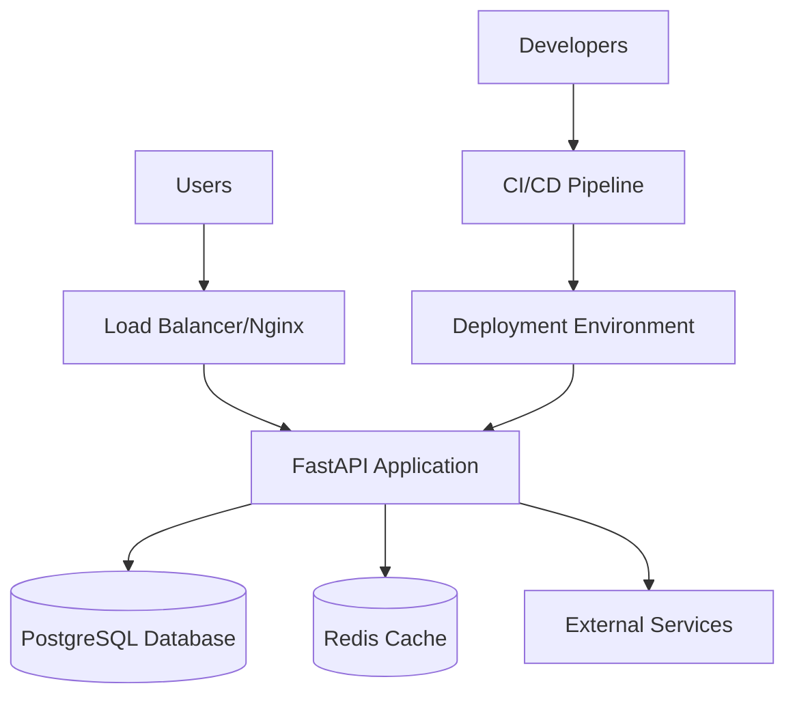
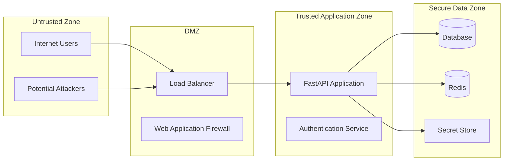
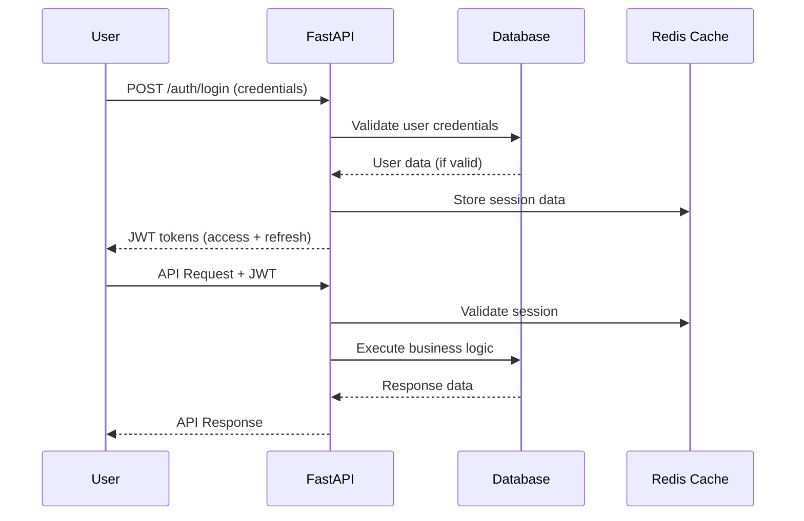
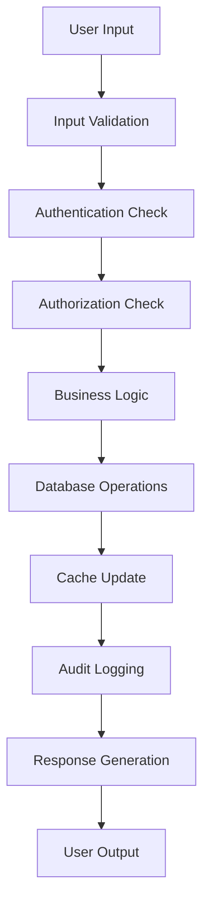

# Threat Model for Psychic-Tribble Calendar & Task Management Platform

## Executive Summary

This document outlines the threat model for Psychic-Tribble, a FastAPI-based calendar and task management platform. It identifies critical assets, potential attack vectors, trust boundaries, and security controls to mitigate identified threats.

## 1. System Overview

### 1.1 Architecture Components

### 1.2 Technology Stack
- **Backend**: FastAPI (Python 3.8+)
- **Database**: PostgreSQL (production), SQLite (development)
- **Cache**: Redis
- **Authentication**: JWT tokens
- **ORM**: SQLAlchemy with async support
- **Migrations**: Alembic
- **Deployment**: Docker, Uvicorn/Gunicorn
- **CI/CD**: GitHub Actions

## 2. Asset Identification

### 2.1 Critical Assets

#### High Value Assets
1. **User Personal Data**
   - Email addresses, usernames, password hashes
   - Calendar events and appointments
   - Task lists and personal productivity data
   - Profile information and preferences

2. **Authentication & Authorization Data**
   - JWT tokens (access and refresh)
   - Session data
   - User roles and permissions
   - API keys and service credentials

3. **System Configuration**
   - Environment variables and secrets
   - Database connection strings
   - Redis configuration
   - Third-party API keys

#### Medium Value Assets
4. **Application Code**
   - Source code and business logic
   - Database schemas and migrations
   - API endpoints and documentation

5. **System Infrastructure**
   - Docker containers and images
   - CI/CD pipelines and secrets
   - Deployment configurations

#### Low Value Assets
6. **Public Information**
   - API documentation
   - Public calendar data (if applicable)
   - System status and health checks

## 3. Entry Points Analysis

### 3.1 External Entry Points

| Entry Point | Protocol | Authentication | Risk Level |
|-------------|----------|----------------|------------|
| REST API Endpoints | HTTPS | JWT Required | HIGH |
| Authentication Endpoints | HTTPS | Credentials | CRITICAL |
| Health Check Endpoint | HTTP/HTTPS | None | LOW |
| Static File Serving | HTTPS | None | LOW |
| WebSocket Connections | WSS | JWT Required | MEDIUM |

### 3.2 Internal Entry Points

| Entry Point | Access Method | Risk Level |
|-------------|---------------|------------|
| Database Connection | PostgreSQL Protocol | HIGH |
| Redis Connection | Redis Protocol | MEDIUM |
| Inter-service Communication | HTTP/Internal | MEDIUM |
| File System Access | Local I/O | MEDIUM |
| Environment Variables | System Access | HIGH |

### 3.3 Administrative Entry Points

| Entry Point | Access Method | Risk Level |
|-------------|---------------|------------|
| CI/CD Pipeline | GitHub Actions | CRITICAL |
| Container Registry | Docker Hub/ECR | HIGH |
| Production Deployment | SSH/Container Orchestration | CRITICAL |
| Database Administration | Direct DB Access | CRITICAL |
| Log Aggregation | Logging Service | MEDIUM |

## 4. Trust Boundaries

### 4.1 Primary Trust Boundaries

### 4.2 Trust Boundary Definitions

1. **Internet → Load Balancer**
   - **Control**: TLS encryption, rate limiting, IP filtering
   - **Validation**: Request size limits, protocol validation
   - **Monitoring**: Access logs, intrusion detection

2. **Load Balancer → Application**
   - **Control**: Internal network segmentation
   - **Validation**: Header validation, request forwarding rules
   - **Monitoring**: Application performance monitoring

3. **Application → Database**
   - **Control**: Connection pooling, encrypted connections
   - **Validation**: SQL injection prevention, parameterized queries
   - **Monitoring**: Query performance, connection monitoring

4. **Application → Redis**
   - **Control**: Authentication, encrypted connections
   - **Validation**: Data serialization validation
   - **Monitoring**: Cache hit rates, connection health

5. **CI/CD → Production**
   - **Control**: Branch protection, required reviews, signed commits
   - **Validation**: Automated security scans, deployment validation
   - **Monitoring**: Deployment logs, change tracking

## 5. Data Flow Analysis

### 5.1 Authentication Flow

### 5.2 Data Processing Flow

### 5.3 Sensitive Data Flows

1. **Password Handling**
   - Input: Plain text password (HTTPS encrypted)
   - Processing: bcrypt hashing with salt
   - Storage: Hashed password in database
   - Transmission: Never transmitted in plain text

2. **JWT Token Flow**
   - Generation: Server-side with secret key
   - Transmission: HTTPS headers
   - Storage: Client-side (localStorage/sessionStorage)
   - Validation: Server-side signature verification

3. **Personal Data Flow**
   - Input: Calendar events, tasks via API
   - Processing: Validation and sanitization
   - Storage: Encrypted at rest in database
   - Access: Role-based access control

## 6. Threat Analysis

### 6.1 STRIDE Threat Categories

#### Spoofing (Authentication Threats)
- **T001**: Weak password policies allowing brute force attacks
- **T002**: JWT token theft and replay attacks
- **T003**: Session hijacking through XSS vulnerabilities
- **T004**: API key compromise and unauthorized access

#### Tampering (Data Integrity Threats)
- **T005**: SQL injection attacks modifying database data
- **T006**: NoSQL injection in Redis cache operations
- **T007**: Man-in-the-middle attacks on API communications
- **T008**: Code injection through file upload vulnerabilities

#### Repudiation (Non-repudiation Threats)
- **T009**: Insufficient audit logging of critical operations
- **T010**: Log tampering or deletion by privileged users
- **T011**: Lack of request traceability across services

#### Information Disclosure (Confidentiality Threats)
- **T012**: Sensitive data exposure through error messages
- **T013**: Database credential exposure in configuration files
- **T014**: API key leakage in client-side code or logs
- **T015**: Personal data exposure through inadequate access controls

#### Denial of Service (Availability Threats)
- **T016**: Application-layer DDoS attacks overwhelming API endpoints
- **T017**: Database connection pool exhaustion
- **T018**: Memory exhaustion through large payload attacks
- **T019**: Algorithmic complexity attacks (ReDoS)

#### Elevation of Privilege (Authorization Threats)
- **T020**: Horizontal privilege escalation between user accounts
- **T021**: Vertical privilege escalation to administrative roles
- **T022**: Container escape attacks in Docker environment
- **T023**: CI/CD pipeline compromise leading to code injection

### 6.2 Risk Assessment Matrix

| Threat ID | Impact | Likelihood | Risk Level | Priority | Mitigation Status |
|-----------|---------|------------|------------|----------|-------------------|
| T001 | High | Medium | High | P1 | Planned |
| T002 | High | Medium | High | P1 | Planned |
| T003 | Medium | Low | Medium | P2 | Planned |
| T004 | High | Low | Medium | P2 | Planned |
| T005 | Critical | Low | High | P1 | In Progress |
| T006 | Medium | Low | Low | P3 | Planned |
| T007 | High | Low | Medium | P2 | Planned |
| T008 | High | Very Low | Low | P3 | Planned |
| T009 | Medium | Medium | Medium | P2 | Not Started |
| T010 | Medium | Low | Low | P3 | Not Started |
| T011 | Low | Medium | Low | P3 | Not Started |
| T012 | Medium | Medium | Medium | P2 | Planned |
| T013 | Critical | Medium | Critical | P1 | In Progress |
| T014 | High | Medium | High | P1 | In Progress |
| T015 | High | Low | Medium | P2 | Planned |
| T016 | High | High | Critical | P1 | Planned |
| T017 | Medium | Medium | Medium | P2 | Planned |
| T018 | Medium | Low | Low | P3 | Planned |
| T019 | Low | Low | Low | P3 | Not Started |
| T020 | High | Medium | High | P1 | Planned |
| T021 | Critical | Low | High | P1 | Planned |
| T022 | High | Low | Medium | P2 | Not Started |
| T023 | Critical | Low | High | P1 | In Progress |

## 7. Security Controls and Mitigations

### 7.1 Authentication Controls

- **AC-001**: Strong password policy enforcement (minimum 12 characters, complexity requirements)
- **AC-002**: Multi-factor authentication for administrative accounts
- **AC-003**: JWT token expiration and rotation policies
- **AC-004**: Account lockout mechanisms for failed login attempts
- **AC-005**: Secure session management with proper timeout

### 7.2 Authorization Controls

- **AZ-001**: Role-based access control (RBAC) implementation
- **AZ-002**: Principle of least privilege enforcement
- **AZ-003**: Resource-level permissions for calendar and task data
- **AZ-004**: API endpoint authorization middleware
- **AZ-005**: Regular access review and deprovisioning processes

### 7.3 Data Protection Controls

- **DP-001**: Encryption at rest for sensitive database fields
- **DP-002**: TLS 1.3 for all external communications
- **DP-003**: Data masking in non-production environments
- **DP-004**: Secure backup and recovery procedures
- **DP-005**: Data retention and deletion policies

### 7.4 Application Security Controls

- **AS-001**: Input validation and sanitization for all user inputs
- **AS-002**: Output encoding to prevent XSS attacks
- **AS-003**: Parameterized queries to prevent SQL injection
- **AS-004**: File upload restrictions and validation
- **AS-005**: Rate limiting on API endpoints

### 7.5 Infrastructure Security Controls

- **IS-001**: Network segmentation and firewall rules
- **IS-002**: Container image vulnerability scanning
- **IS-003**: Secrets management using environment variables
- **IS-004**: Regular security patches and updates
- **IS-005**: Intrusion detection and monitoring

### 7.6 Operational Security Controls

- **OS-001**: Comprehensive audit logging
- **OS-002**: Security incident response procedures
- **OS-003**: Regular penetration testing
- **OS-004**: Security training for development team
- **OS-005**: Code review processes including security review

## 8. Monitoring and Detection

### 8.1 Security Monitoring

- **Authentication anomalies**: Multiple failed login attempts, unusual login locations
- **Authorization violations**: Attempts to access unauthorized resources
- **Data access patterns**: Unusual data access volumes or patterns
- **API abuse**: Rate limit violations, suspicious request patterns
- **System health**: Performance degradation, resource exhaustion

### 8.2 Alerting Thresholds

- **Critical**: Authentication bypass attempts, privilege escalation, data exfiltration
- **High**: Multiple failed authentications, unauthorized API access attempts
- **Medium**: Unusual access patterns, performance anomalies
- **Low**: Policy violations, configuration changes

### 8.3 Incident Response

1. **Detection**: Automated monitoring and manual reporting
2. **Analysis**: Threat categorization and impact assessment
3. **Containment**: Immediate response to limit damage
4. **Eradication**: Remove threat and close vulnerabilities
5. **Recovery**: Restore normal operations
6. **Post-Incident**: Lessons learned and process improvement

## 9. Assumptions and Constraints

### 9.1 Assumptions

- Users will use supported browsers with modern security features
- Network infrastructure provides basic DDoS protection
- Development team follows secure coding practices
- Regular security updates will be applied to dependencies
- Backup and disaster recovery procedures are in place

### 9.2 Constraints

- Budget limitations for security tooling and services
- Development timeline constraints for security feature implementation
- Third-party dependency security limitations
- Compliance requirements may impose additional controls
- Resource constraints for security monitoring and response

## 10. Review and Updates

This threat model should be reviewed and updated:

- **Quarterly**: Regular review of threat landscape and risk assessment
- **After significant changes**: Architecture changes, new features, security incidents
- **Annual**: Comprehensive review and penetration testing
- **As needed**: New threats, vulnerabilities, or compliance requirements

## Document Information

- **Version**: 1.0
- **Last Updated**: 2025-09-26
- **Next Review**: 2026-04-15
- **Owner**: Security Team
- **Reviewers**: Development Team, DevOps Team, Management

---

*This document is classified as Internal Use Only and should not be shared outside the organization without proper authorization.*
